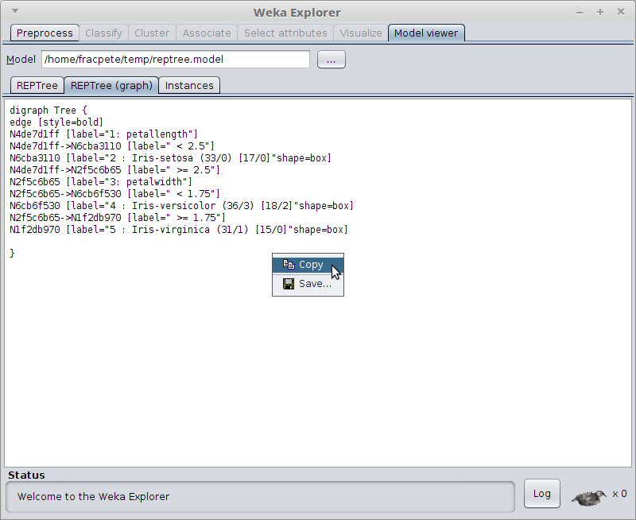

# serialized-model-viewer-weka-package

Adds a tab to the Weka Explorer which allows the user to load a serialized
model (or actually any Java serialized file) and display the string
representation of its content.

## Releases

* [2019.1.27](https://github.com/fracpete/serialized-model-viewer-weka-package/releases/download/v2019.1.27/serialized-model-viewer-2019.1.27.zip)
* [2015.3.26](https://github.com/fracpete/serialized-model-viewer-weka-package/releases/download/v2015.3.26/serialized-model-viewer-2015.3.26.zip)

## How to use packages

For more information on how to install the package, see:

https://waikato.github.io/weka-wiki/packages/manager/

## Screenshot

Displaying a `REPTree` model:

Popup menu for copying/saving text:

s